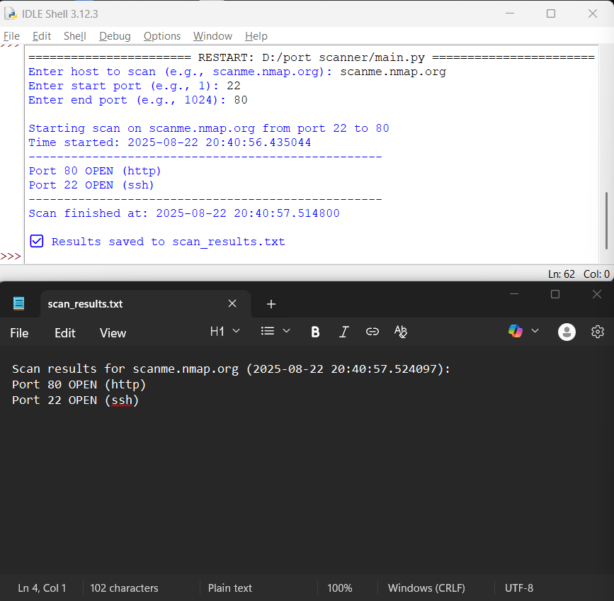

# 📘 Port Scanner



---

## 📌 Overview
A simple Python-based **Port Scanner** that scans a given host for open ports in a specified range.  
It uses **TCP socket connections** to check whether a port is open or closed, and then saves the results for future reference.  

---

## 🛠️ Features
- Accepts a target host (e.g., `scanme.nmap.org` or `127.0.0.1`)  
- Scans a custom range of ports (e.g., `20–1024`)  
- Shows **service names** (HTTP, SSH, etc.) using `socket.getservbyport`  
- Uses **multithreading** for faster scanning  
- **Saves results** into a `.txt` file  

---

## 💾 How Results Are Saved
- After scanning, the program creates a file `scan_results.txt`  
- Each open port is logged with:  
  - **Port Number**  
  - **Status (OPEN)**  
  - **Service Name** (like `http`, `ssh`)  
  - **Timestamp of the scan**  

📖 Example : `scan_results.txt`


---

## ⚡ Why Save Results?
- **Reference** → You don’t lose scan results after closing the terminal.  
- **Security/Debugging** → Helps track which services were exposed during a scan.  
- **Reporting** → Saved file can be shared with teammates/admins for auditing.  

---

## ▶️ Usage
Install Python dependencies (only standard library used):  
```bash
# No external libraries required
python main.py
